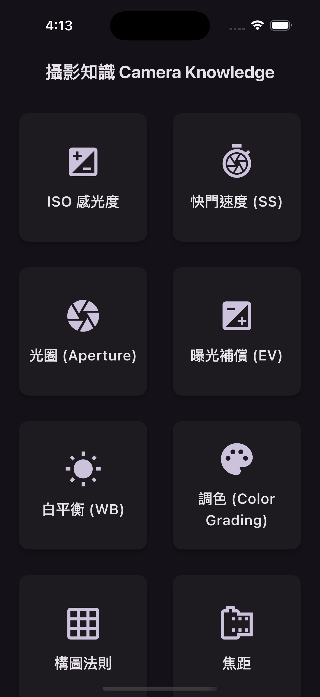
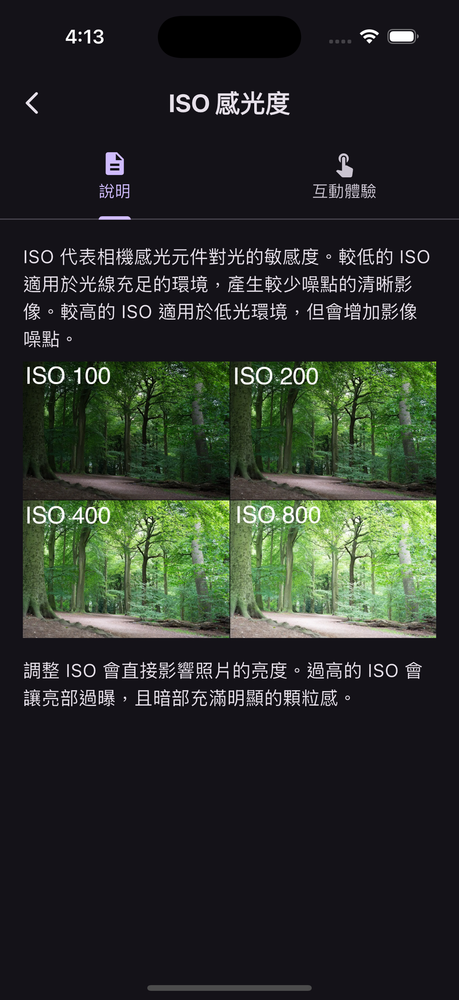
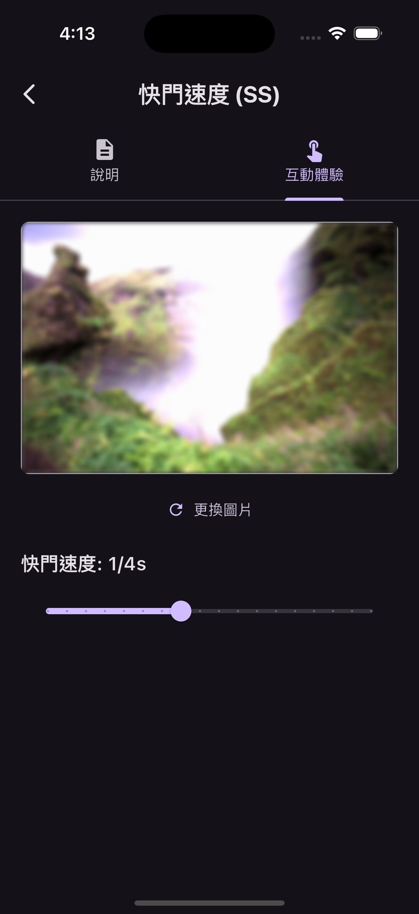
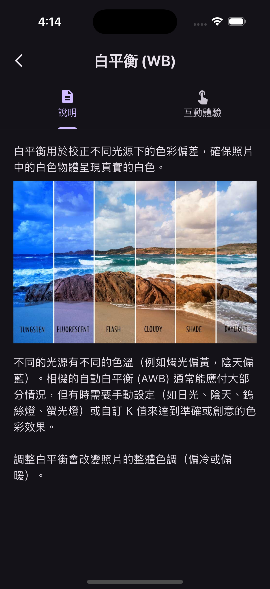
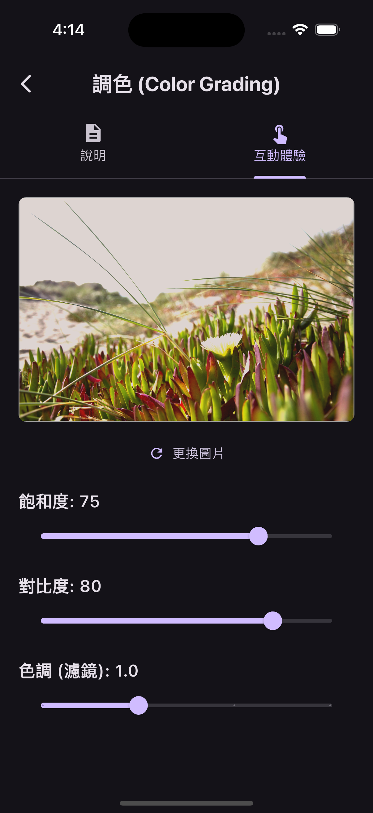
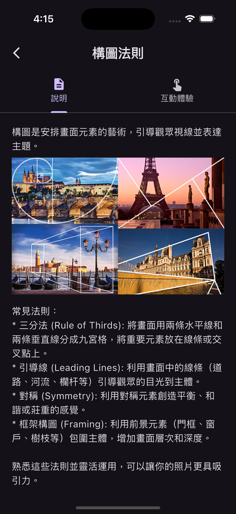

# 攝影互動學習 App (Photography Interactive Learning App)

一個使用 Flutter 開發的互動式電子書 App，旨在幫助使用者透過文字說明、圖片範例和互動式參數調整來學習基礎攝影概念。

## 主要功能

* **概念總覽:** 主畫面以網格 (`GridView`) 展示多個攝影概念 (ISO, 快門速度, 光圈, 曝光補償, 白平衡, 調色, 構圖法則, 焦距)。
* **卡片式設計:** 使用 `Card` Widget 呈現每個概念的入口，包含圖示和名稱。
* **詳細說明:** 點擊概念卡片 (`InkWell`) 進入詳細頁面 (`ConceptDetailScreen`)。
* **分頁內容:** 詳細頁面使用分頁 (`TabBarView`) 呈現「說明」與「互動體驗」。
* **圖文說明:** 「說明」頁籤使用 `ListView.builder` 顯示文字段落及對應的範例圖片/GIF (`Image.asset`)。 (圖片透過 `imageAssets` 列表管理)
* **互動模擬:** 「互動體驗」頁籤 (`InteractiveDemo` - `StatefulWidget`) 允許使用者：
    * 從手機相簿選擇照片 (`image_picker`)。
    * 透過滑桿 (`Slider`) 等控制項調整與概念相關的參數。
    * 即時預覽參數調整對照片產生的模擬視覺效果。
* **頁面導航:** 使用 `Navigator` 和 `MaterialPageRoute` 進行頁面跳轉。
* **背景音樂:** App 啟動時自動循環播放背景音樂 (`audioplayers`)。

## 畫面截圖

(使用 HTML 表格實現並排顯示)

<table>
  <tr>
    <td align="center"></td>
    <td align="center"></td>
    <td align="center"></td>
  </tr>
  <tr>
    <td align="center"></td>
    <td align="center"></td>
    <td align="center"></td>
  </tr>
</table>

## 技術棧與主要套件

* **框架:** Flutter
* **語言:** Dart
* **狀態管理:** `setState` (主要用於互動頁面)
* **主要套件:**
    * `image_picker`: 用於從相簿選擇圖片
    * `audioplayers`: 用於播放背景音樂
    * (`flutter_markdown`): 如果描述文字仍需 Markdown 格式化，則需要。

## 專案結構

```
your_project_name/
├── android/
├── assets/        # 資源檔資料夾
│   ├── images/    # 存放圖片/GIF 資源 (包含 1.png - 6.png 等)
│   └── music/     # 存放背景音樂檔案
├── ios/
├── lib/
│   ├── data/         # 存放範例資料 (sample_data.dart)
│   ├── main.dart     # App 進入點、MaterialApp
│   ├── models/       # 資料模型 (photography_concept.dart)
│   ├── screens/      # 主要頁面 (home_screen.dart, concept_detail_screen.dart)
│   ├── services/     # 服務邏輯 (audio_player_service.dart)
│   └── widgets/      # 可重用的小元件 (concept_card.dart, interactive_demo.dart)
├── pubspec.yaml   # 專案設定檔
└── ... (其他檔案和資料夾)
```

## 安裝與執行

1.  **Clone 專案:**
    ```bash
    git clone <repository_url>
    ```
2.  **進入專案目錄:**
    ```bash
    cd <project_directory>
    ```
3.  **建立資源資料夾:** 在專案根目錄建立 `assets/images/` 和 `assets/music/` 資料夾。
4.  **放置資源檔案:**
    * 將教學圖片/GIF (如 `ISO.webp`, `Shutter.gif`, `EV.jpg`, `WB.jpg`, `composition.jpg`, `focal.jpeg`, 以及您的 `1.png` - `6.png` 等) 放入 `assets/images/`。
    * 將背景音樂檔案 (例如 `background.mp3`) 放入 `assets/music/`。
5.  **確認 `pubspec.yaml`:** 確保 `pubspec.yaml` 中的 `flutter:` -> `assets:` 區塊已正確宣告 `assets/images/` 和 `assets/music/`。
    ```yaml
    flutter:
      uses-material-design: true
      assets:
        - assets/music/
        - assets/images/
    ```
6.  **設定權限 (若尚未設定):**
    * **Android:** 在 `android/app/src/main/AndroidManifest.xml` 中加入 `<uses-permission android:name="android.permission.READ_MEDIA_IMAGES"/>` (或 `READ_EXTERNAL_STORAGE`)。
    * **iOS:** 在 `ios/Runner/Info.plist` 中加入 `NSPhotoLibraryUsageDescription` 的說明文字。
7.  **取得 Flutter 套件:**
    ```bash
    flutter pub get
    ```
8.  **執行 App:**
    ```bash
    flutter run
    ```
    (選擇您的模擬器或實體裝置)

## 使用說明

1.  啟動 App 後，您會看到主畫面顯示各種攝影概念的卡片。
2.  點擊任一卡片進入該概念的詳細頁面。
3.  在詳細頁面中，您可以切換「說明」和「互動體驗」兩個分頁。
    * 「說明」頁籤包含文字解釋和範例圖片。
    * 「互動體驗」頁籤允許您選擇自己的照片，並調整參數觀察效果變化。
4.  App 會自動播放背景音樂。

